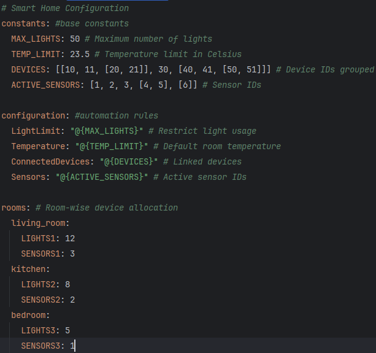
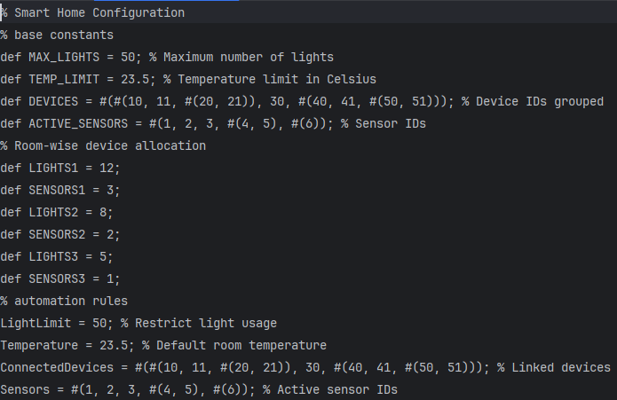
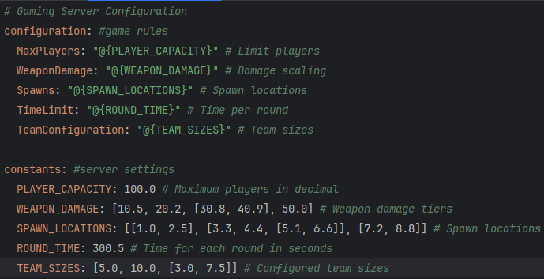
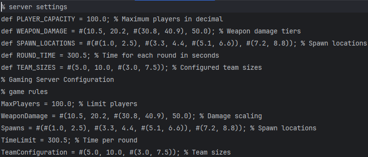
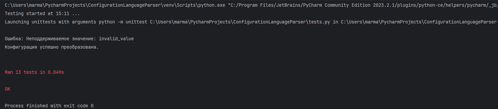

# Парсер YAML в язык конфигурации

---

## Общее описание

**Парсер YAML в язык конфигурации** — это инструмент для преобразования данных из YAML-файлов в специальный язык конфигурации. Парсер обрабатывает константы, конфигурационные правила и комментарии, преобразуя их в формат, соответствующий заданным правилам синтаксиса.

---

## Правила языка конфигурации

- **Комментарии**: Однострочные комментарии обозначаются символом `%`.  
  Пример:
  ```plaintext
  % Это однострочный комментарий
- **Массивы**: Поддерживаются как одномерные, так и вложенные массивы.  
  Пример:
  ```plaintext
  #(значение1, значение2, значение3)
- **Имена**: Идентификаторы для констант и переменных должны соответствовать следующему формату:
  ```plaintext
  [_A-Z][_a-zA-Z0-9]*
- **Значения**: Поддерживаются следующие типы значений:
  - Числа (целые и вещественные).
  - Массивы (включая вложенные).
- **Объявление константы**: Константы определяются на этапе трансляции с помощью ключевого слова `def`.  
  Пример:
  ```plaintext
  def CONSTANT_NAME = значение;
- **Вычисление значений**: Ссылки на константы указываются с помощью конструкции `@{имя}`. На этапе трансляции ссылка заменяется соответствующим значением.  

---

## Описание функций

### Класс `YAMLToConfigParser`

Класс отвечает за обработку YAML-файла, проверку корректности синтаксиса, преобразование данных и формирование выходного файла в формате языка конфигурации.

---

### Методы

#### `validate_name(name)`
- **Описание**: Проверяет, соответствует ли имя идентификатора правилам языка конфигурации.
- **Параметры**:
  - `name` (str): Имя идентификатора для проверки.
- **Исключения**: Выбрасывает `ConfigParserError`, если имя невалидно.

---

#### `parse_value(value)`
- **Описание**: Распознает и обрабатывает строковые значения, поддерживая числа, массивы и вложенные массивы.
- **Параметры**:
  - `value` (str): Строковое представление значения.
- **Возвращаемое значение**: Преобразованное значение в формате языка конфигурации.
- **Исключения**: Выбрасывает `ConfigParserError`, если значение не поддерживается.

---

#### `parse_array(array_str)`
- **Описание**: Обрабатывает строки, представляющие массивы, включая вложенные массивы.
- **Параметры**:
  - `array_str` (str): Строка с массивом в формате YAML.
- **Возвращаемое значение**: Преобразованное представление массива в формате языка конфигурации.
- **Исключения**: Выбрасывает `ConfigParserError`, если формат массива невалиден.

---

#### `process_constant_line(line)`
- **Описание**: Обрабатывает строку из секции `constants`, проверяет корректность имени и преобразует значение.
- **Параметры**:
  - `line` (str): Строка из блока `constants`.
- **Возвращаемое значение**: Готовая строка объявления константы в формате языка конфигурации.
- **Исключения**: 
  - Выбрасывает `ConfigParserError`, если имя некорректно, значение невалидно или обнаружено дублирование.

---

#### `process_configuration_line(line)`
- **Описание**: Обрабатывает строку из секции `configuration`, проверяет корректность ссылки на константу и заменяет её значением.
- **Параметры**:
  - `line` (str): Строка из блока `configuration`.
- **Возвращаемое значение**: Готовая строка конфигурационного правила в формате языка конфигурации.
- **Исключения**:
  - Выбрасывает `ConfigParserError`, если ссылка на константу невалидна или константа не определена.

---

#### `parse(yaml_data)`
- **Описание**: Основной метод для обработки YAML-данных. Выполняет разбор строк, классификацию на типы, преобразование значений и формирование выходного результата.
- **Параметры**:
  - `yaml_data` (str): Содержимое YAML-файла.
- **Возвращаемое значение**: Строка с выходным текстом в формате языка конфигурации.
- **Исключения**: Выбрасывает `ConfigParserError` при любых ошибках обработки.

---

### Функция `main(input_file, output_file)`
- **Описание**: Точка входа для работы с парсером. Читает данные из входного YAML-файла, преобразует их с использованием класса `YAMLToConfigParser` и сохраняет результат в выходной файл.
- **Параметры**:
  - `input_file` (str): Путь к входному YAML-файлу.
  - `output_file` (str): Путь для сохранения выходного файла.
- **Вывод**: Сообщение о результате преобразования.
- **Исключения**: Выбрасывает `ConfigParserError` при ошибке преобразования.

---

## Примеры использования
Первый входной файл:



Первый выходной файл:



Второй входной файл:



Второй выходной файл:



---

## Результаты тестирования


